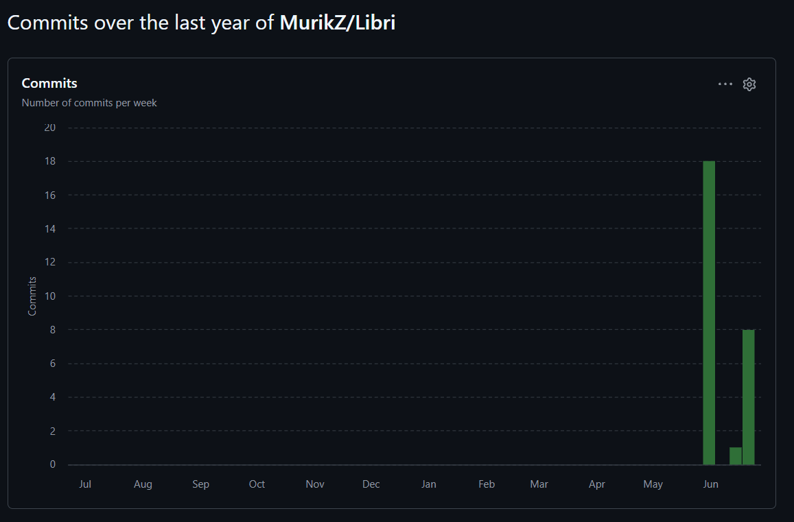
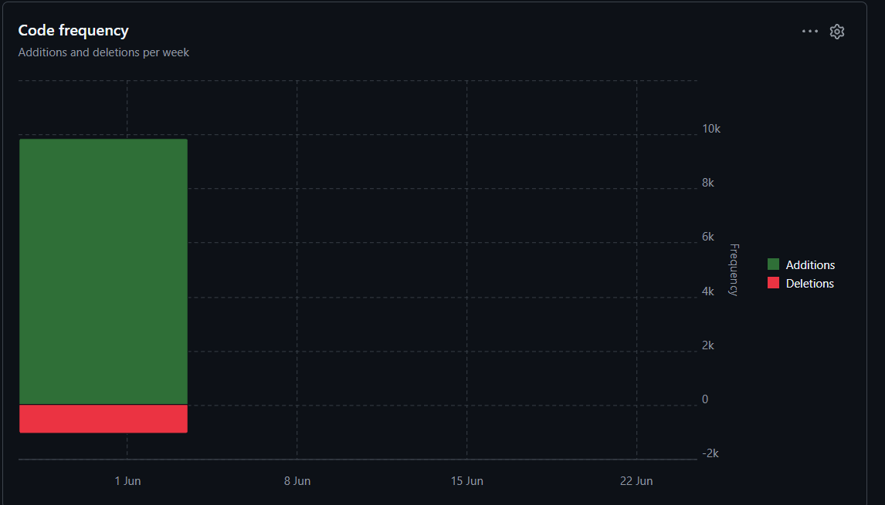

# Libri — Мобильная информационная система библиотеки

> Курсовой проект | СКФУ | 09.03.04 Программная инженерия | Группа ПИЖ-б-о-23-1  
> **Автор:** Залов Мурат Рашидович | **Руководитель:** Новикова Елена Николаевна
> **Траектория В** — Мобильное приложение + Серверная часть

---

## О проекте

**Libri** — клиент-серверная информационная система для управления библиотекой. Позволяет читателям просматривать каталог, бронировать и отслеживать выданные книги, а библиотекарям — управлять выдачами, возвратами и штрафами.

---

## Стек технологий

| Компонент | Android-клиент | Spring Boot-сервер |
|-----------|----------------|---------------------|
| Язык | Kotlin | Java 17 |
| UI / API | Jetpack Compose + Material 3 | REST + OpenAPI 3.0 (Swagger) |
| Архитектура | PCMEF → MVVM + StateFlow | PCMEF (Control–Mediator–Entity–Foundation) |
| БД | Room (SQLite, offline-кэш) | PostgreSQL 14 |
| Сеть | Retrofit 2 + OkHttp 4 | Spring Security 6 + JWT |
| DI | Hilt | — |
| Сборка | Gradle (KTS) | Maven |
| Тесты | — | JUnit 5 + Mockito (>40% покрытие) |

---

## Архитектура (PCMEF)

```
Presentation  →  Control       →  Mediator (Service)  →  Entity (JPA)  →  Foundation (Repository)
LoginScreen       AuthController    AuthService            User              UserRepository
CatalogScreen     BookController    BookService            Book              BookRepository
MyBooksScreen     LoanController    LoanService            Loan              LoanRepository
LibrarianScreen   FineController    FineService            Fine              FineRepository
```

---

## Запуск

### 1. База данных (PostgreSQL)

```sql
CREATE USER libri WITH PASSWORD 'libri_secret';
CREATE DATABASE libri_db OWNER libri;
\i docs/04-database/ddl.sql
```

### 2. Сервер

```bash
cd server
mvn spring-boot:run
```

Swagger UI: http://localhost:8080/swagger-ui.html  
API docs: http://localhost:8080/v3/api-docs

### 3. Android-клиент

Открыть проект в Android Studio, запустить на эмуляторе.

> Эмулятор использует `10.0.2.2` как адрес хоста — сервер должен работать на `localhost:8080`

---

## REST API (15 эндпоинтов)

| Метод | URL | Роль | Описание |
|-------|-----|------|----------|
| POST | `/api/auth/login` | — | JWT-вход |
| POST | `/api/auth/register` | — | Регистрация |
| GET | `/api/books` | ALL | Список с пагинацией |
| GET | `/api/books/{id}` | ALL | Книга по ID |
| GET | `/api/books/search` | ALL | Поиск |
| POST | `/api/books` | LIBRARIAN, ADMIN | Создать книгу |
| PUT | `/api/books/{id}` | LIBRARIAN, ADMIN | Обновить книгу |
| DELETE | `/api/books/{id}` | ADMIN | Удалить книгу |
| POST | `/api/loans` | LIBRARIAN, ADMIN | Выдать книгу |
| PUT | `/api/loans/{id}/return` | LIBRARIAN, ADMIN | Вернуть книгу |
| GET | `/api/loans/user/{userId}` | ALL | Выдачи пользователя |
| GET | `/api/fines/user/{userId}` | ALL | Штрафы пользователя |
| PUT | `/api/fines/{id}/pay` | ALL | Оплатить штраф |
| POST | `/api/reservations` | ALL | Забронировать книгу |
| DELETE | `/api/reservations/{id}` | ALL | Отменить бронь |

---

## Бизнес-правила

| Код | Правило |
|-----|---------|
| BR-01 | Максимум **5 активных выдач** на одного читателя |
| BR-03 | Штраф за просрочку: **5 ₽ / день** |
| BR-05 | Нельзя взять книгу при наличии **неоплаченных штрафов** |
| BR-06 | Бронирование действует **3 дня** |

---

## Тестовые аккаунты

| Email | Пароль | Роль |
|-------|--------|------|
| reader@lib.ru | 123456 | READER |
| librarian@lib.ru | 123456 | LIBRARIAN |
| admin@lib.ru | 123456 | ADMIN |

---

## Структура репозитория

```
libri/
├── app/                    # Android-клиент (Kotlin + Compose)
│   └── src/main/java/com/libri/app/
│       ├── data/remote/    # Retrofit API + DTO
│       ├── data/local/     # Room entities + DAO
│       ├── di/             # Hilt: NetworkModule, DatabaseModule
│       ├── repository/     # Mediator: сеть + Room-кэш
│       └── presentation/   # Экраны + ViewModel
├── server/                 # Spring Boot сервер (Java 17)
│   └── src/main/java/com/libri/server/
│       ├── control/        # REST Controllers
│       ├── mediator/       # Services (бизнес-логика)
│       ├── entity/         # JPA entities
│       ├── foundation/     # Spring Data репозитории
│       ├── security/       # JWT
│       └── dto/            # Request/Response DTO
├── docs/
│   ├── 01-business-model/  # IDEF0, BUC
│   ├── 02-requirements/    # Use-case диаграммы
│   ├── 03-architecture/    # PCMEF схема
│   ├── 04-database/        # ER-диаграмма + DDL
│   ├── 05-design/          # Sequence диаграммы
│   └── 06-implementation/  # Описание кода и тестов
└── README.md
```

---

## Тесты сервера

```bash
cd server
mvn test
# Отчёт JaCoCo: target/site/jacoco/index.html
```

| Класс | Тестов | Что проверяет |
|-------|--------|---------------|
| `LoanServiceTest` | 7 | Бизнес-правила BR-01, BR-03, BR-05 |
| `BookServiceTest` | 4 | CRUD каталога, дубли ISBN |
| `FineServiceTest` | 5 | Оплата штрафов, повторная оплата |
| `BookControllerTest` | 5 | MockMvc, авторизация по ролям |
| `LoanControllerTest` | 4 | MockMvc, выдача и возврат |

## Статистика разработки

### Метрики Git

- Всего коммитов: 30
- Период: 03.03.2026 — 22.06.2026
- Средняя частота: 1.7 коммита/день в активный период

### График активности коммитов



### График добавлений и удалений кода

