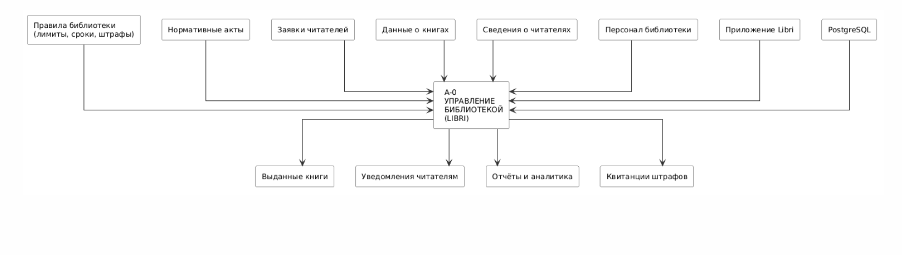
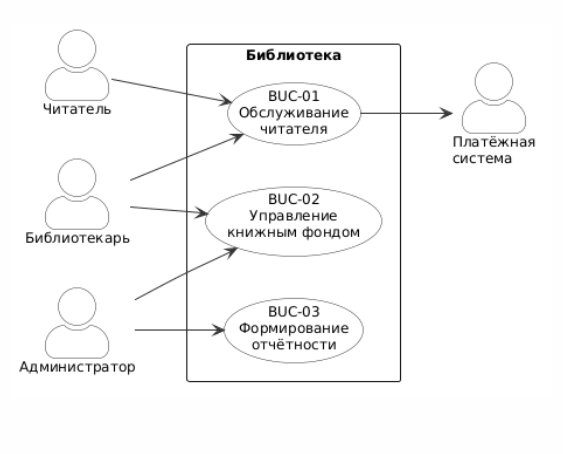

# Этап 0: Бизнес-анализ

**Недели:** 1–2 | **Вес:** 5%

## IDEF0 — Диаграмма бизнес-контекста (A-0)

Контекстная диаграмма описывает библиотеку как единый процесс. Входы: заявки читателей, данные о книгах. Выходы: выданные книги, уведомления, отчёты. Управление: правила библиотеки (лимит 5 книг, срок 30 дней, штраф 5 руб./день). Механизмы: персонал, приложение Libri, сервер Spring Boot, PostgreSQL.

## BUC — Диаграмма бизнес-прецедентов

Выделяет три бизнес-прецедента верхнего уровня: «Обслуживание читателя» (выдача, возврат, бронирование), «Управление книжным фондом» (каталог, экземпляры), «Формирование отчётности» (аналитика для администрации).

## Глоссарий

[glossary.md](glossary.md) — 20 терминов предметной области: Book, Loan, Fine, Reservation, PCMEF, Room, JWT и др.
