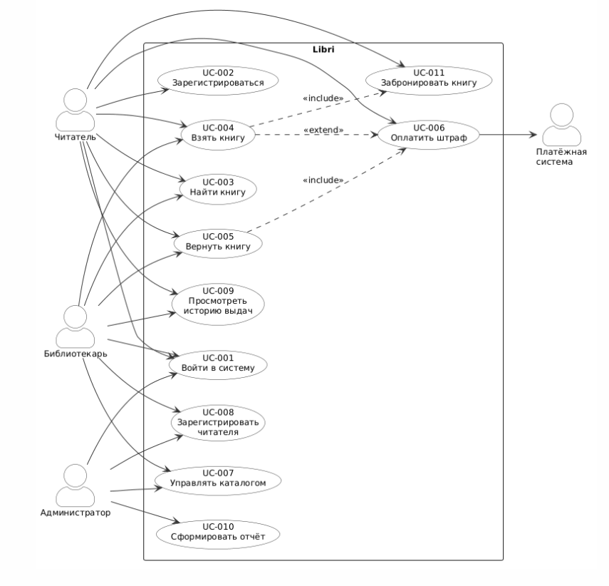
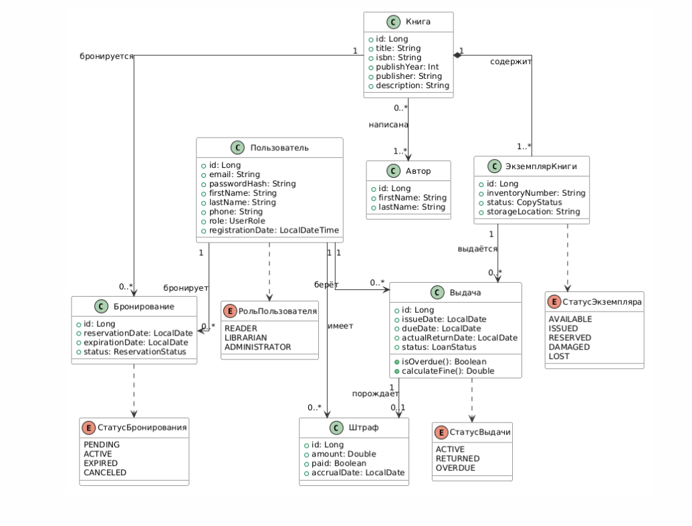

# Требования

## Функциональные требования

### FR-01: Аутентификация
- Регистрация с выбором роли (Читатель/Библиотекарь/Администратор)
- Вход по email + пароль (SHA-256 хеш)
- Сессия сохраняется в DataStore — при перезапуске приложения восстанавливается

### FR-02: Каталог
- Просмотр всех книг с авторами, годом, статусом
- Поиск по названию (debounce 300ms)
- Фильтрация: Все / Доступные / Выданные / Забронированные

### FR-03: Детали книги
- Отображение полной информации о книге
- Кнопка «Забронировать» (Reader, статус AVAILABLE)
- Кнопка «Отменить бронь» (при наличии активной брони)

### FR-04: Мои книги
- Вкладка «Выдачи» — активные выдачи с датой возврата
- Вкладка «Брони» — активные брони с кнопкой отмены
- Вкладка «История» — все прошлые выдачи
- Отображение просрочки красным, оплата штрафа

### FR-05: Профиль
- Инициалы-аватар, ФИО, роль, дата регистрации
- Список штрафов с кнопкой оплаты
- Выход из аккаунта

### FR-06: Управление (Библиотекарь/Администратор)
- Выдача книги: выбор читателя + книги
- Приём возврата: список активных выдач
- Управление каталогом: просмотр и удаление книг
- Добавление книги через FAB на экране каталога

## Нефункциональные требования

| NFR | Описание |
|---|---|
| NFR-01 | minSdk 26 (Android 8.0) |
| NFR-02 | Работа без сети (только локальная БД) |
| NFR-03 | Время отклика UI < 100ms (Flow + Compose) |
| NFR-04 | Хранение паролей только в виде SHA-256 хеша |

## Use Cases (основные)

```
UC-01: Войти в систему
  Актор: Любой пользователь
  Предусловие: Аккаунт зарегистрирован
  Основной поток: Ввод email+пароль → валидация → сохранение сессии → CatalogScreen

UC-02: Забронировать книгу
  Актор: Читатель
  Предусловие: Книга доступна, нет активной брони
  Основной поток: CatalogScreen → BookDetail → «Забронировать» → Reservation создана
  Альтернативы: Книга недоступна → кнопка неактивна

UC-03: Выдать книгу
  Актор: Библиотекарь
  Предусловие: Экземпляр доступен, читатель < 5 выдач, нет штрафов
  Основной поток: LibrarianScreen → выбор читателя + книги → createLoan()

UC-04: Принять возврат
  Актор: Библиотекарь
  Основной поток: LibrarianScreen → список активных выдач → returnBook()
  Постусловие: если просрочка — автоматически создаётся Fine (5 руб./день)
```

## Диаграммы




