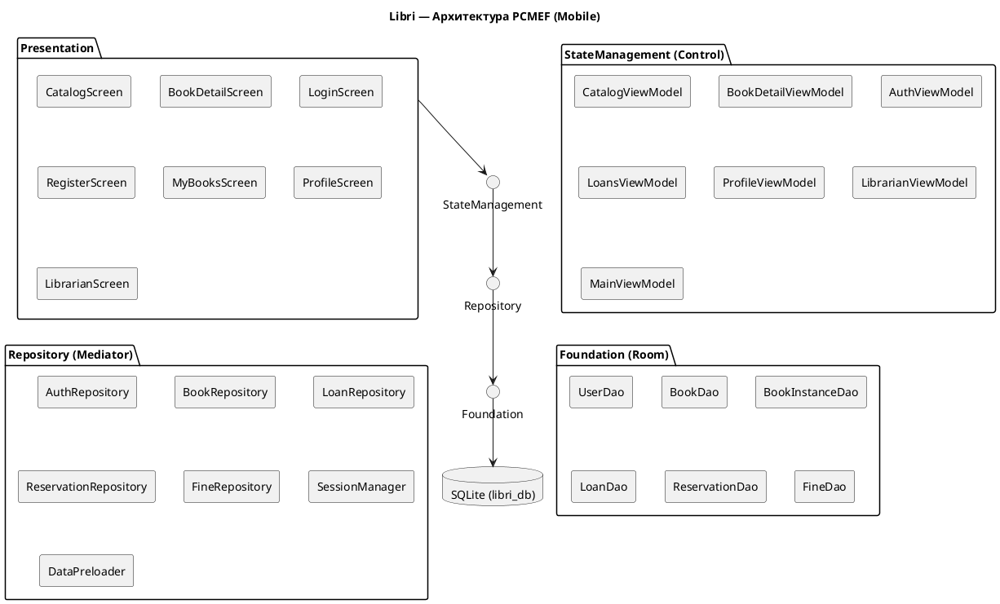
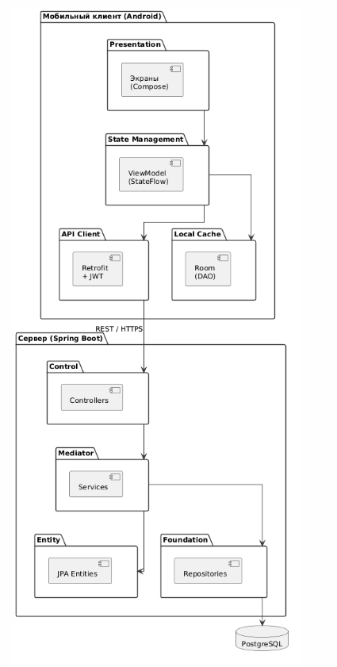

# Архитектура PCMEF

Приложение Libri реализует **адаптированную архитектуру PCMEF** для мобильной разработки.

## Слои архитектуры

| Слой PCMEF | Реализация в Android | Пакет |
|---|---|---|
| **Presentation** | Composable-экраны | `presentation/` |
| **Control (State Management)** | ViewModel + StateFlow | `presentation/*/ViewModel` |
| **Mediator** | Repository (бизнес-логика) | `repository/` |
| **Entity** | Domain Models | `domain/model/` |
| **Foundation** | Room DAO + SQLite | `data/` |

## Правило зависимостей

```
Presentation → ViewModel → Repository → DAO → Room/SQLite
```

Зависимости направлены строго вниз. Нижние слои не знают о верхних.

## PlantUML — Диаграмма пакетов



## Потоки данных

### Вход пользователя

```
LoginScreen → AuthViewModel.login()
  → AuthRepository.login()
    → UserDao.login() [Room query]
    → SessionManager.saveSession() [DataStore]
  ← Result<UserEntity>
← SessionState.LoggedIn → навигация на Main
```

### Бронирование книги

```
BookDetailScreen → BookDetailViewModel.reserve()
  → ReservationRepository.reserve()
    → ReservationDao.insert() [Room]
    → BookInstanceDao.update(RESERVED) [Room]
  ← Result<Unit>
← StateFlow обновляется → UI перерисовывается
```

## Диаграммы




