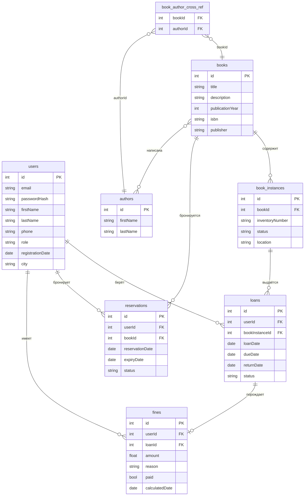
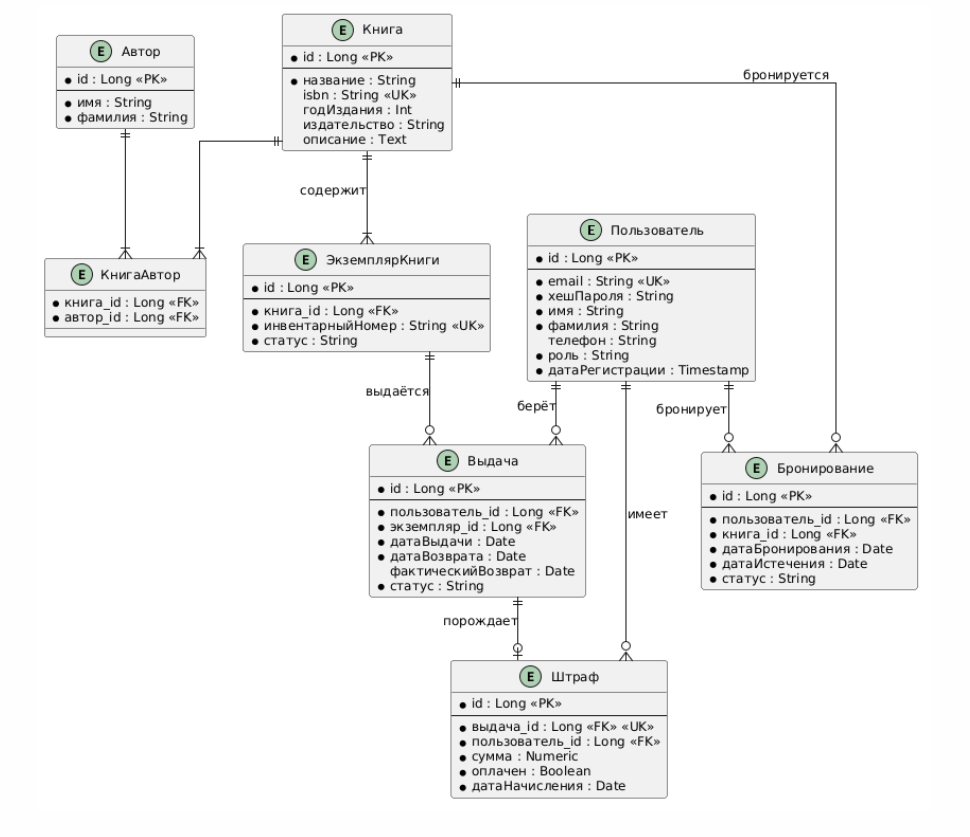

# База данных

## ER-диаграмма (Mermaid)

## Описание таблиц

| Таблица | Назначение |
|---|---|
| `users` | Пользователи системы (читатели, библиотекари, администраторы) |
| `books` | Библиографические данные книг |
| `authors` | Авторы (М:N с books) |
| `book_author_cross_ref` | Связь книг и авторов (many-to-many) |
| `book_instances` | Физические экземпляры книг |
| `loans` | Записи о выдачах |
| `reservations` | Брони на книги (срок 3 дня) |
| `fines` | Штрафы за просрочку (5 руб./день) |

## Бизнес-правила

- Лимит выдач на читателя: **5 книг**
- Срок бронирования: **3 дня**
- Срок выдачи: **14 дней**
- Штраф за просрочку: **5 руб./день**
- Нельзя взять книгу при наличии неоплаченных штрафов

## Диаграмма

