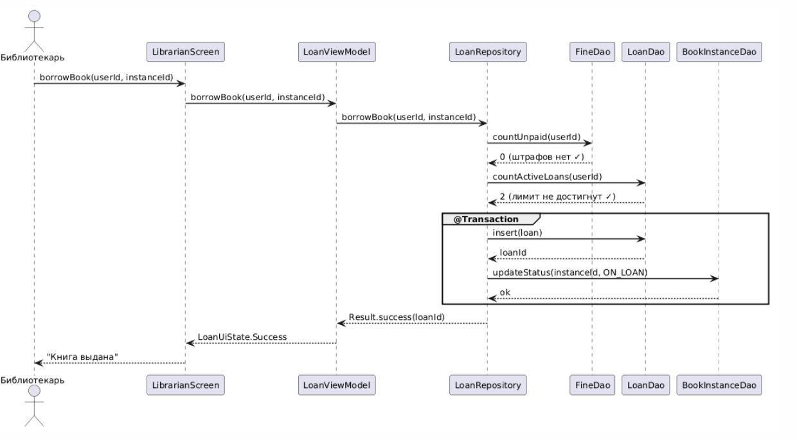
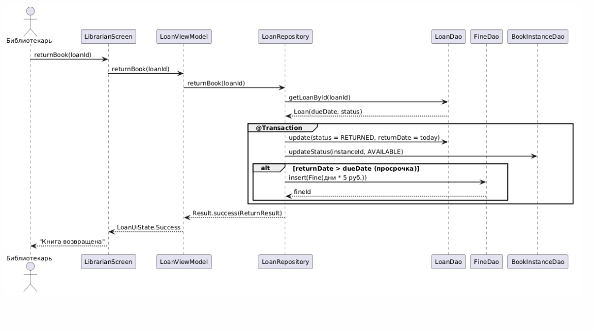
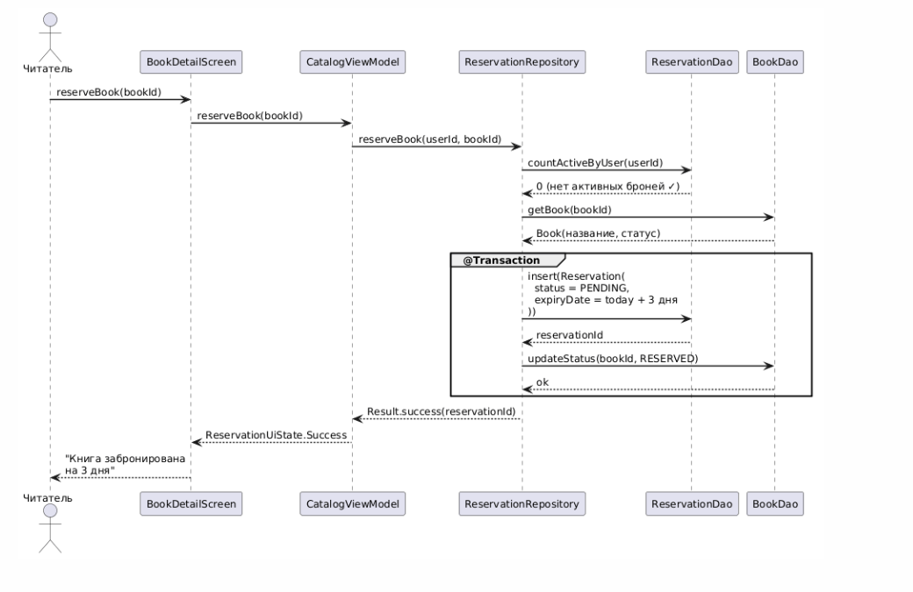

# Этап 4: Детальное проектирование

**Недели:** 9–10 | **Вес:** 10%

## UC-004: Взять книгу

Последовательность: LibrarianScreen → LoanViewModel → LoanRepository → проверка штрафов (FineDao) → проверка лимита (LoanDao) → атомарная транзакция: создание Loan + обновление статуса BookInstance на ON_LOAN.

## UC-005: Вернуть книгу

Последовательность: LibrarianScreen → LoanViewModel → LoanRepository → обновление Loan (RETURNED) + обновление BookInstance (AVAILABLE). Если returnDate > dueDate — автоматически создаётся Fine = дни × 5 руб. Все операции атомарны (@Transaction).

## UC-011: Забронировать книгу

Последовательность: BookDetailScreen → CatalogViewModel → ReservationRepository → проверка активных броней → создание Reservation(PENDING) с expiryDate = today + 3 дня + обновление статуса книги на RESERVED.

