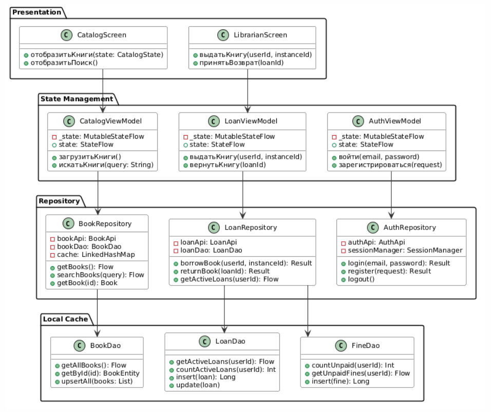

# Реализация

## Структура кода

### Слой данных (`data/`)

**`data/entity/`** — Room Entity классы и перечисления:
- `Enums.kt` — `UserRole`, `BookStatus`, `LoanStatus`, `ReservationStatus`
- `UserEntity.kt` — пользователь системы
- `BookEntity.kt` — книга + `AuthorEntity` + `BookAuthorCrossRef` + `BookWithAuthors`
- `BookInstanceEntity.kt` — физический экземпляр книги
- `LoanEntity.kt` — выдача
- `ReservationEntity.kt` — бронирование
- `FineEntity.kt` — штраф

**`data/db/`**:
- `AppDatabase.kt` — Room database (8 таблиц, version 1)
- `Converters.kt` — TypeConverter для `LocalDate` (ISO-8601 string) и enum-ов

**`data/dao/`** — интерфейсы Room DAO:
- `UserDao` — вход, поиск по email/id, список читателей
- `BookDao` — CRUD книг, поиск с авторами (`@Transaction`)
- `BookInstanceDao` — поиск доступных экземпляров
- `LoanDao` — активные/историчные выдачи, счётчики
- `ReservationDao` — активные брони, проверка дублей
- `FineDao` — штрафы, счётчик неоплаченных

### Слой репозитория (`repository/`)

- `SessionManager` — DataStore Preferences: userId + userRole
- `AuthRepository` — вход (SHA-256), регистрация, текущий пользователь
- `BookRepository` — каталог, поиск, добавление/удаление книг
- `LoanRepository` — выдача, возврат, бизнес-правила
- `ReservationRepository` — бронирование, отмена
- `FineRepository` — оплата штрафов
- `DataPreloader` — начальная загрузка тестовых данных

### Слой доменных моделей (`domain/model/`)

`DomainModels.kt` содержит Kotlin data class без Room-аннотаций:
`User`, `Book`, `Loan`, `Reservation`, `Fine`

### Слой представления (`presentation/`)

Каждый экран следует паттерну: `Screen.kt` (Composable) + `ViewModel.kt` (HiltViewModel)

| Модуль | Экраны | ViewModel |
|---|---|---|
| `auth/` | LoginScreen, RegisterScreen | AuthViewModel |
| `catalog/` | CatalogScreen, BookDetailScreen | CatalogViewModel, BookDetailViewModel |
| `loans/` | MyBooksScreen | LoansViewModel |
| `profile/` | ProfileScreen | ProfileViewModel |
| `librarian/` | LibrarianScreen | LibrarianViewModel |
| `navigation/` | LibriApp, AuthNavHost, MainNavHost, BottomNavBar | MainViewModel |
| `theme/` | Color.kt, Type.kt, Theme.kt | — |

## Ключевые технические решения

### Обработка LocalDate в Room
TypeConverter преобразует `LocalDate` в ISO-строку ("2026-05-27"). minSdk 26 поддерживает `java.time` нативно.

### State Management
```kotlin
val uiState: StateFlow<CatalogUiState> = combine(
    _allBooks, _filter, _searchQuery, _message
) { books, filter, query, message -> ... }
.stateIn(viewModelScope, SharingStarted.WhileSubscribed(5_000), CatalogUiState())
```

### Сессия через DataStore
MainViewModel наблюдает за `SessionState`. Смена состояния (LoggedIn/LoggedOut) автоматически переключает NavHost между AuthNavHost и MainNavHost.

### Защита пароля
```kotlin
fun hashPassword(password: String): String {
    val digest = MessageDigest.getInstance("SHA-256")
    return digest.digest(password.toByteArray()).joinToString("") { "%02x".format(it) }
}
```

## Диаграмма классов


