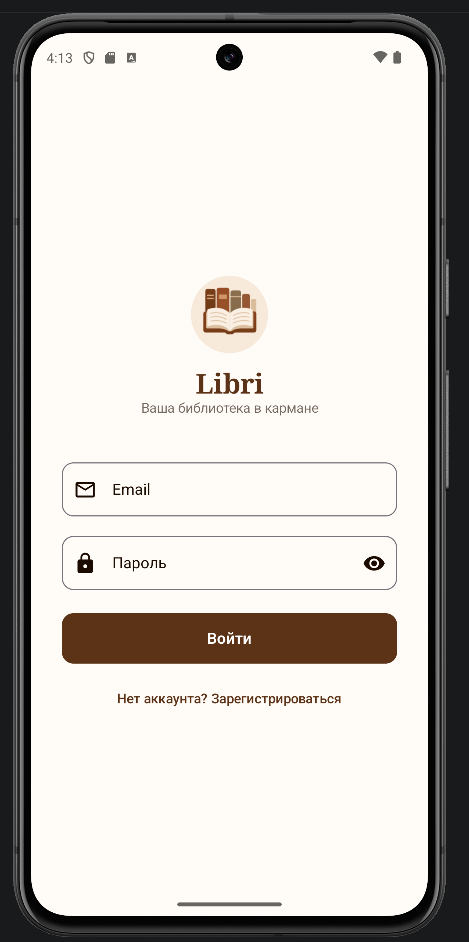
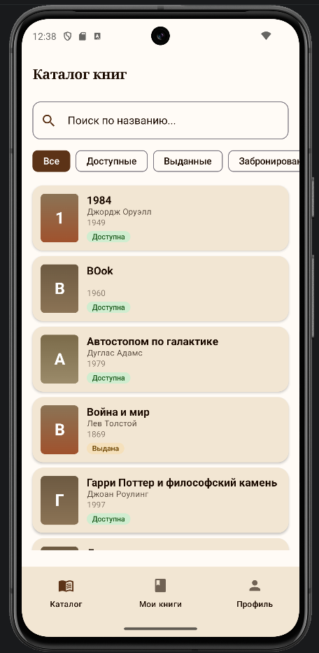
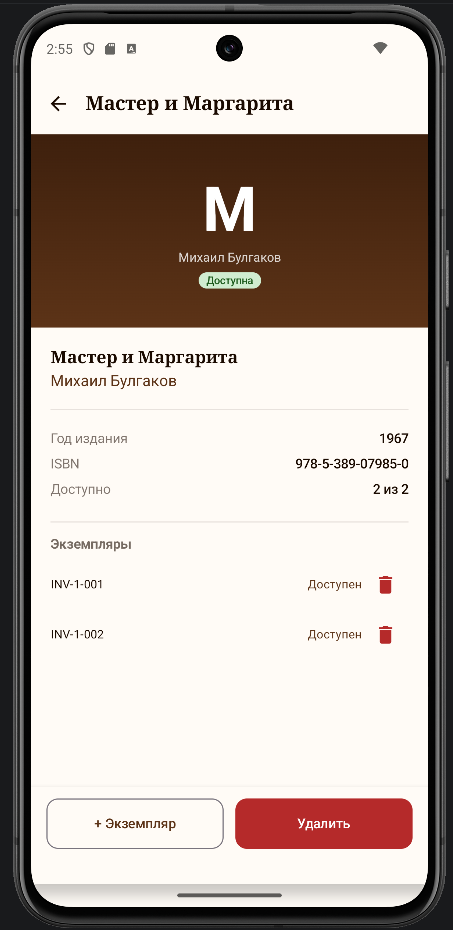
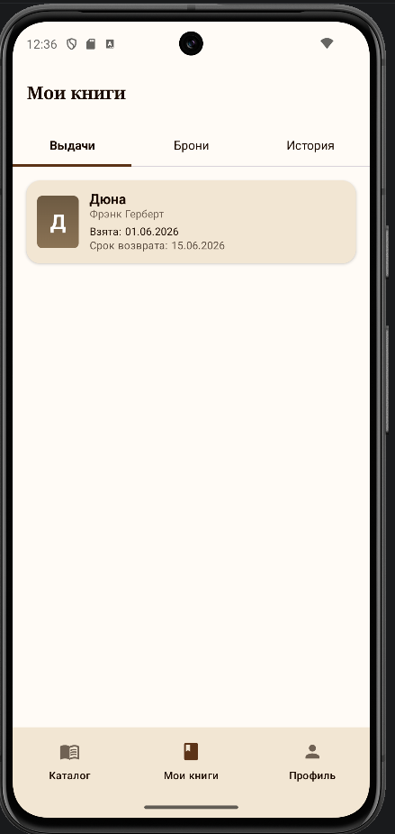
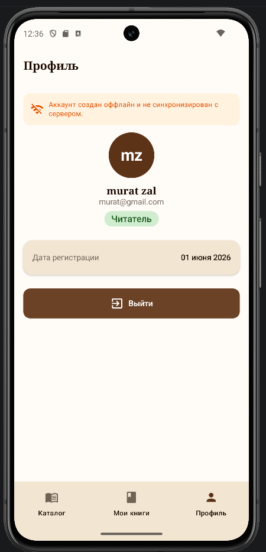
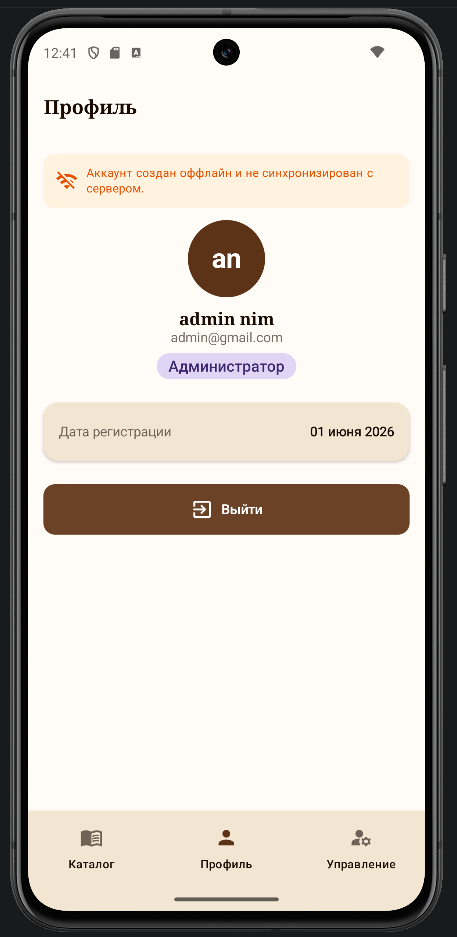

# Этап 7: Пользовательский интерфейс

**Недели:** 15–16 | **Вес:** 15%

## Дизайн-концепция «Тёплая библиотека»

Палитра: Primary #8B7355 (коричневый), Background #FAF6F0 (кремовый), Surface #F5EFE6. Шрифт — sans-serif. Карточки со скруглёнными углами 12dp.

## Экраны

### LoginScreen — Экран входа
Поля email и пароль, кнопка «Войти», ссылка на регистрацию. Логотип с иконкой книги.

### CatalogScreen — Каталог книг
Список книг с поиском и фильтрами по статусу (Все / Доступные / Выданные / Забронированные). Каждая карточка показывает обложку, название, автора, год и статус.

### BookDetailScreen — Детали книги
Обложка книги, информация (ISBN, год, издательство, доступные экземпляры). Кнопки действий зависят от роли: читатель видит «Забронировать», администратор — «Выдать», «Добавить экземпляр», «Удалить».

### MyBooksScreen — Мои книги
Три вкладки: Выдачи (активные), Брони, История. Показывает текущие выдачи с датой возврата и штрафы.

### ProfileScreen — Профиль
Аватар с инициалами, имя, email, роль, дата регистрации, кнопка выхода.

### LibrarianScreen — Панель администратора
Управление выдачей и возвратом книг по инвентарному номеру, добавление новых книг в каталог.

### Swagger UI — REST API документация
Автоматически генерируемая документация всех 15 эндпоинтов API. Доступна по адресу http://localhost:8080/swagger-ui.html

