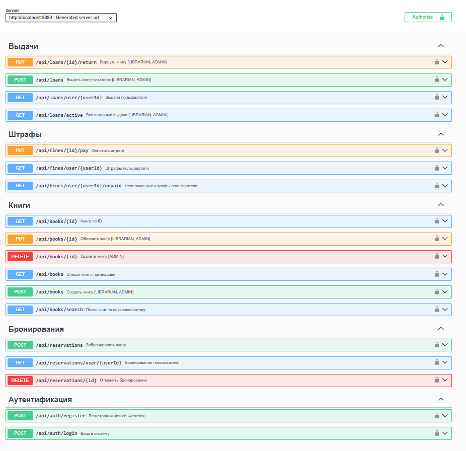

# Итоговая документация

## Состав проекта

| Раздел | Описание |
|---|---|
| [01 — Бизнес-модель](../01-business-model/README.md) | Стейкхолдеры, глоссарий, IDEF0, BUC |
| [02 — Требования](../02-requirements/README.md) | Функциональные и нефункциональные требования, Use Case |
| [03 — Архитектура](../03-architecture/README.md) | PCMEF-архитектура, диаграмма пакетов, потоки данных |
| [04 — База данных](../04-database/README.md) | ER-диаграмма, описание таблиц, бизнес-правила |
| [05 — Проектирование](../05-design/README.md) | Диаграммы последовательности UC-004, UC-005, UC-011 |
| [06 — Реализация](../06-implementation/README.md) | Структура кода, технические решения, диаграмма классов |
| [07 — UI](../07-ui/README.md) | Дизайн-концепция, цветовая палитра, скриншоты экранов |

## Руководства

### Руководство пользователя (Читатель)

1. Зарегистрируйтесь, выбрав роль **Читатель**
2. На экране **Каталог** найдите книгу по названию или используйте фильтры
3. Откройте карточку книги → нажмите **Забронировать** (доступно, если статус «Доступна»)
4. Следите за активными бронями и выдачами на экране **Мои книги**
5. Оплатите штрафы (если есть) в разделе **Профиль**

### Руководство библиотекаря

1. Войдите с ролью **Библиотекарь** или **Администратор**
2. На экране **Управление** выберите читателя и книгу → нажмите **Выдать**
3. Для приёма возврата найдите выдачу в списке активных → нажмите **Принять возврат**
4. Добавляйте книги через кнопку **+** на экране каталога
5. Управляйте экземплярами в деталях книги (добавление / удаление)

## Swagger UI

REST API документация (Spring Boot сервер):

